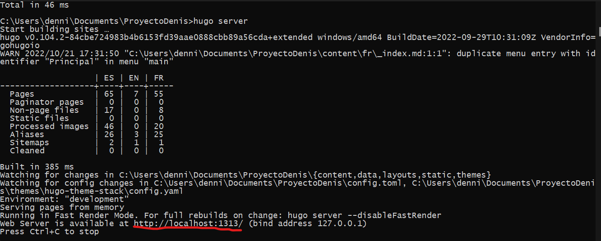

## Site creation

**Comands**

We will first create the website folder and go into it using the following commands

    hugo new site sitename

    cd sitename

Once these commands are executed, our page will already be created

**Install a theme**

In order to install a theme, the first thing to do is to position yourself inside the sitename/themes folder using the commands:

    cd sitename/themes

Once inside, we will have to clone the theme using the git clone command:

    git clone https://github.com/McShelby/hugo-theme-relearn.git

In this case I will use the Relearn theme as it is the simplest, but any theme can be used (some themes need plugins)

Now you have to enter the theme and delete .git to avoid any problem

    cd hugo-them-release
    rm -rf .git

Now we just have to run the server and check if it works (**Tip**: With Visual Studio Code or another IDE it is better to open our website folder, go inside the theme and look for the ExampleSite/content folder and copy all its content to the first content at the top):

    hugo server

The url that appears in the CMD is taken and accessed through a browser

