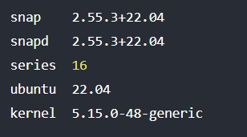

## Como instalar hugo, textos de ejemplos/guia para mas tarde

**Instalar Snap**

Para instalar Hugo en Linux vamos a utilizar el gestor de paquetes Snap. Por ello lo primero que vamos a hacer es comprobar si tenemos este gestor instalado, para ello utilizaremos el siguiente comando:

>``
    snap version
``

Si el resultado es parecido al siguiente significa que esta instalado

Si no aparece algo parecido, significa que no esta instalado, para hacerlo simplemente agrega en la consola de comandos lo siguiente

>``
apt-get install snapd -y
``

Y volveriamos al paso anterior para comprobar si esta instalado

## Instalar Hugo-Extended

Ahora usaremos el gestor **Snap** para instalar Hugo-Extended,para hacerlo hay que acceder a una consola de comandos en introducir lo siguiente:

>``
snap instal hugo --channel=extended
``

