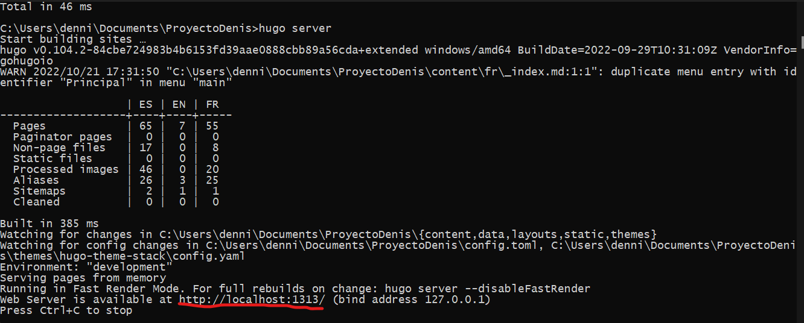

## Creacion del sitio

**Comandos**

Primero crearemos la carpeta del sitio web y entraremos en ella usando los siguientes comandos

    hugo new site nombredelsitio

    cd nombredelsitio

Una vez ejecutado estos comandos, nuestra pagina ya estara creada

**Instalar un tema**

Para poder instalar un tema lo primero que hay que hacer es posicionarse dentro de la carpeta nombredelsitio/themes mediante los comandos:

    cd nombredelsitio/themes

Una vez dentro, habra que clonar el tema usando el comando git clone:

    git clone https://github.com/McShelby/hugo-theme-relearn.git

En este caso usare el tema Relearn ya que es el mas simple, pero se puede usar cualquier tema (algunos temas necesitan complementos)

Ahora hay que entrar dentro del tema y borrar .git para evitar cualquier problema

    cd hugo-them-relearn
    rm -rf .git

Ahora simplemente habra que ejecutar el servidor y comprobar si funciona (**Consejo**: Con Visual Studio Code u otro IDE es mejor abrir la carpeta de nuestra web, entrar dentro del tema y buscar la carpeta ExampleSite/content y copiar todo su contenido al primer content que hay arriba del todo):

    hugo server

Se coge el url que sale en el CMD y se accede atraves de un navegador

