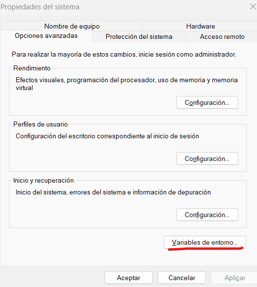
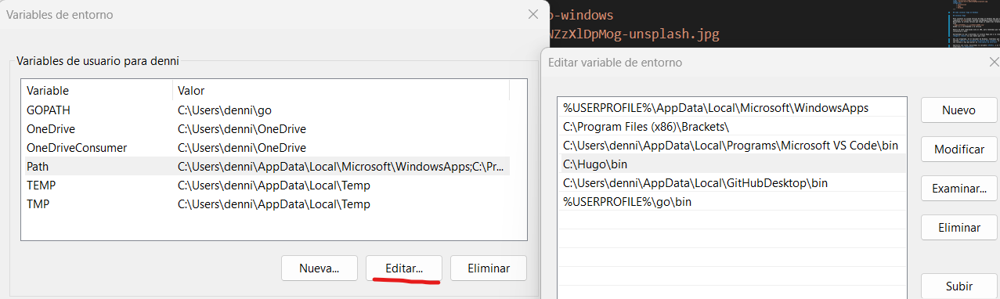

## Como instalar hugo en Windows

## Instalar Hugo

Para instalar la ultima version de Hugo en Windows hay que acceder al siguiente *[link](https://github.com/gohugoio/hugo/releases)*.
Buscaremos la ultima version que tenga un nombre del formato parecido a este
``hugo_extended_x.x.x_windows-amd64.zip``
donde x.x.x corresponde a la version

Dentro de este comprimido esta el CMS, pero tendremos que realizar la instalacion a mano.

Extraeremos el zip y moveremos el archivo Hugo.exe a la ruta C:\ **Hugo**\ **bin** la cual habra que crear

Una vez preparado, en el buscador de Windows, tendremos que buscar la opciond **Editar las variables de entorno desl sitema**, se nos abrira una ventana y hay que pulsar en **Variables de entorno**

   

Aparecera una lista, buscaremos la variable **PATH**, y al final de este añadiremos **C:\Hugo\bin**.

Ahora simplemente hay que reiniciar y Hugo ya estaria listo
